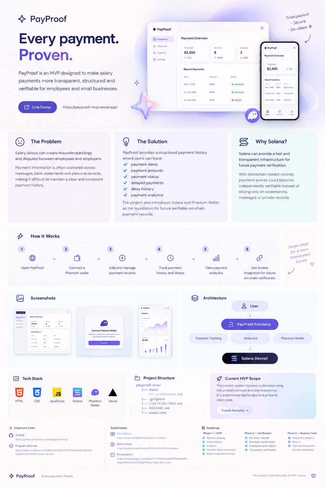

PayProof
Every payment. Proven.
Transparent salary tracking for employees and small businesses.
Live Demo · GitHub · Solana Program

⸻

  

⸻

✦ About
PayProof is a lightweight Web3-focused MVP that helps employees and small businesses keep salary payments organized, track delays, and understand payment history through analytics.
The project combines a simple payment-tracking experience with Phantom Wallet, Solana Devnet and an Anchor program as the foundation for future verifiable payment records.

⸻

✦ The Problem
Salary payments can become difficult to track when information is scattered across messages, screenshots and bank statements.
This can make it difficult for employees and businesses to maintain a clear and consistent payment history.

⸻

✦ The Solution
PayProof brings payment information into one structured place.
Users can:
Track payment amounts
Record payment dates
Monitor payment status
Identify delayed payments
Review delay history
Explore payment analytics
Connect a Phantom wallet

⸻

✦ Features
Payment Tracking
Keep salary payments structured and easy to review.
Delay Monitoring
Track delayed payments and identify repeated payment issues.
Analytics
Understand payment history and payment patterns through a simple dashboard.
Phantom Wallet
Connect a Solana wallet directly from the application.
Solana Devnet
The project includes a deployed Anchor program on Solana Devnet, providing the foundation for future on-chain payment verification.

⸻

✦ Solana Integration
PayProof includes a deployed Solana program built with Anchor.
Network
Solana Devnet
Program ID
EJkAW3JKPKDFUw3b6gVvJMnhY21CR9qg7a8nqaZrZM7p
Program Explorer
View PayProof on Solana Explorer
The Anchor project is included directly in this repository.

⸻

✦ Tech Stack
Technology
Purpose
HTML
Frontend structure
CSS
Interface and styling
JavaScript
Application logic
Solana
Blockchain infrastructure
Anchor
Solana program framework
Phantom
Wallet connection
Vercel
Web deployment

⸻

✦ Project Structure
payproof-mvp/
│
├── docs/
│   └── payproof-overview.png
│
├── programs/
│   └── payproof/
│       ├── src/
│       │   └── lib.rs
│       └── Cargo.toml
│
├── tests/
│   └── payproof.ts
│
├── Anchor.toml
├── Cargo.toml
├── LICENSE
├── CONTRIBUTING.md
├── index.html
├── style.css
├── script.js
├── Phantom wallet.html
└── README.md

⸻

✦ Current MVP
The current version demonstrates the core PayProof experience:
Payment tracking
Payment status
Delay monitoring
Analytics
Phantom Wallet connection
Solana Devnet integration
Deployed Anchor program
Live web application

⸻

✦ Roadmap
Phase 1 — MVP
Payment tracking · Delay monitoring · Analytics · Phantom Wallet · Solana integration
Phase 2 — Verification
On-chain payment records · Employer confirmation · Employee confirmation · Transaction verification
Phase 3 — Business Tools
Accounting analytics · Reports · Payment integrations · Business dashboard

⸻

✦ Submission
Pitch
Watch Pitch Video
Demo
Watch Demo Video
Presentation
Open Presentation

⸻

✦ Links
Live Demo
GitHub Repository
Solana Devnet Program

⸻

✦ License
MIT License

⸻

PayProof
Every payment. Proven.

